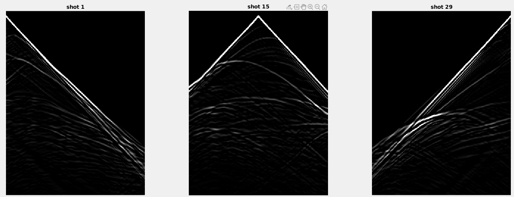
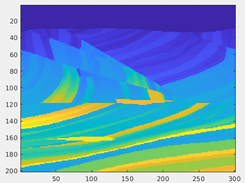

# scripts_and_dockerfiles

This folder contains scripts to generate shots using software devito 4.0

Abaixo apresento 3 shots gerados a partir do respectivo código, onde apresentamos os shots gerados a partir de fontes localizadas a 100, 1500 e 2900 metros de distância.

Todos os shots foram gerados com o auxílio do devito na versão 4.0, é possível realizar a instalação do mesmo pelo link [https://www.devitoproject.org/]. Também possuo um conteiner com a distribuição utilizada nesse projeto disponível no dockerHub conforme
 o link [https://hub.docker.com/r/jmtargino/devito].

Utilizando o comando "docker pull jmtargino/devito" você pode utilizar a distribuição.

O modelo de velocidade utilizado para gerar os shots pode ser visualizado logo abaixo, o mesmo apresenta as dimensões (201,301)

Para paralelizar os códigos no processo de geração dos shots utilizei dos bashs de execução o ./run_batch.sh e o ./run_batch_spoonge.sh que contém a divisão dos arquivos de execução entre 8 processadores, de modo a maximizar o tempo de execução.

Cada um dos .sh possui seu respectivo main de execução, onde o main_shot.py é responsável por rodar os modelos no devito.

Para interpolar os dados de acordo com a dimensão desejada disponho dos códigos de interpolação em código python e matlab. Enquanto o generate_data.m é responsável por recortar os modelos de velocidade da dimensão (402,251) para a dimensão (201,301) dos modelos com borda.

Logo temos o seguinte fluxo:

1 - Modelo de velocidade (201,301) - aplicamos a adição de borda no mesmo com o script AddBorderLayerToVmodels.m

2- Novos modelos de velocidade (402,251) com adição de borda utilizamos o .run_batch_border.sh para aplicar o devito em todos os modelos de velocidade.

3 - Após obtermos os shotRecords com dimensão (2000,29) vamos separar os shotRecords na pasta georec/ e também separar os modelos de velocidade com dimensão original (201,301) na pasta vmodel/ e com isso rodar a DNN.

Vale lembrar que não utilizamos os modelos de velocidade com dimensão (402,251) para treinar a rede, esses modelos servem apenas para reduzir a reflexão nas bordas dos modelos de velocidade. Pois essa é uma situação atípica que ocorre com os modelos.

